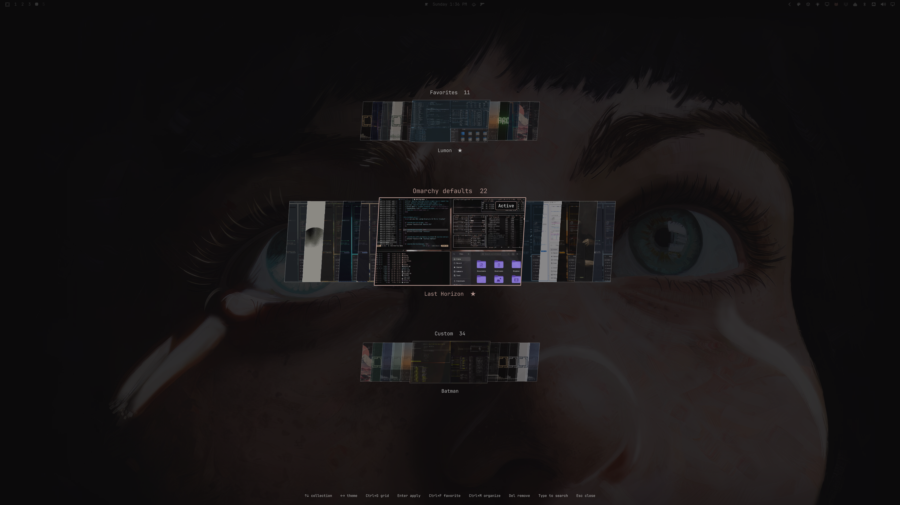

# Extended Theme Picker

Browse your Omarchy themes in collections, star your favorites, and switch between a card carousel and a grouped grid.



Extended Theme Picker is a community replacement for the built-in `omarchy.image-picker` plugin. It keeps the usual theme shortcut and menu routes, and preserves the native single-row picker for wallpapers and other image selection. Disable it to return to the native picker.

## Compatibility

Tested on Omarchy **4.0.4-1** with its Quickshell shell and plugin manager. Requires the built-in `omarchy.image-picker`, its theme preview cache, the `qs.Commons` QML components, and Python 3. These come from the tested Omarchy installation. Older installations without `omarchy plugin add` are not supported. Compatibility with other releases has not been established.

This plugin contains a modified copy of the built-in picker. Upstream picker changes need to be incorporated into this repository; they do not automatically update the copied code.

## Install

```sh
omarchy plugin add https://github.com/ejuro/omarchy-extended-theme-picker.git --enable
```

Follow Omarchy's confirmation prompt. Open your normal theme picker to use it. If you already use another replacement for `omarchy.image-picker`, disable that replacement first so only one is enabled.

## Controls

| Action | Shortcut |
| --- | --- |
| Switch cards / grid | Ctrl+G |
| Change collection | Tab / Shift+Tab |
| Browse cards | Left / Right |
| Change collection in cards | Up / Down |
| Navigate grid tiles | Arrow keys |
| Apply selected theme | Enter |
| Toggle favorite | Ctrl+F |
| Edit collection memberships | Ctrl+M |
| Create collection | Ctrl+N |
| Rename current user collection | Ctrl+R |
| Removal choices | Delete |
| Search theme and collection names | Type |
| Clear search | Ctrl+Backspace |
| Close dialog / picker | Escape |

Click a tile to select it; click the selected tile to apply it. In grid view, Tab and Shift+Tab focus the first theme in the destination collection. Arrow keys can cross collection boundaries. Card navigation wraps horizontally and stops at the first/last collection vertically.

The order is Favorites, Omarchy defaults, Custom, then your collections. Stock theme overlays remain under Omarchy defaults. A theme can belong to multiple collections. Up to 100 user collections are supported. Searching for a collection name shows all its themes; matching theme names remain visible in other collections.

The picker opens on the active theme in Favorites if it is starred, otherwise in your last-used collection when possible, then Custom or Omarchy defaults. An **Active** badge distinguishes the applied theme from the browsing selection. Layout and collection preference survive restarts.

## Organize and remove

Use Ctrl+M to change memberships. “New collection…” creates a collection and adds the selected theme in one step. To delete a collection here, highlight it and press Delete (or click “Delete collection”), then confirm. You return to the membership menu, and all themes stay installed. Favorites cannot be deleted.

Delete opens choices followed by a confirmation. Removing a membership or a collection keeps theme files installed. **Uninstall removes a user-installed theme's files, including local edits, and its memberships.** The active theme and Omarchy defaults cannot be uninstalled here. Escape returns from confirmation to the choices.

## Update

```sh
omarchy plugin update io.github.ejuro.extended-theme-picker
omarchy restart shell
```

The restart ensures updated QML components are loaded; plugin rescanning can retain cached components.

## Disable or uninstall

Restore the native picker:

```sh
omarchy plugin disable io.github.ejuro.extended-theme-picker
```

Enable again:

```sh
omarchy plugin enable io.github.ejuro.extended-theme-picker
```

Remove the plugin:

```sh
omarchy plugin remove io.github.ejuro.extended-theme-picker
```

Collections remain in `~/.config/omarchy/theme-collections.json`, with the previous saved version in `theme-collections.json.bak`. Saves are atomic and rapid edits are queued. No favorites or collections are bundled with the installation. Favorites are independent of the Theme Favorites usage-statistics plugin.

## License and attribution

MIT licensed. Based on [Omarchy](https://github.com/basecamp/omarchy)'s built-in image picker, copyright David Heinemeier Hansson. The original notice and the copyright for these modifications are preserved in [LICENSE](LICENSE).

Theme artwork shown in the preview belongs to its respective creators and is not covered by the plugin’s code license. This is an independent community plugin, not an official Omarchy release.
